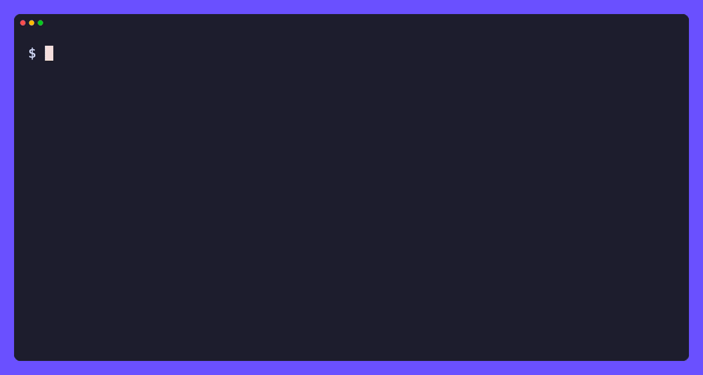

# bili

[](https://github.com/tamnd/bilibili-cli/actions/workflows/ci.yml)
[](https://github.com/tamnd/bilibili-cli/releases/latest)
[](https://pkg.go.dev/github.com/tamnd/bilibili-cli)
[](https://goreportcard.com/report/github.com/tamnd/bilibili-cli)
[](./LICENSE)

A command line for [bilibili.com](https://www.bilibili.com). `bili` resolves
any video, user, comment, danmaku, dynamic, live room, bangumi, audio, article,
or favorite folder into clean structured records. One pure-Go binary, no API
key, no login.

[Install](#install) • [Commands](#commands) • [Usage](#usage) • [How it works](#how-it-works)



It talks to the public bilibili web endpoints over plain HTTPS: WBI signing,
anonymous `buvid` session bootstrap, `{code, message, data}` envelope
unwrapping, av/BV id conversion, and protobuf danmaku decoding are all handled
for you. A cookie is optional: pass `--cookie` and `bili` reaches the same data
your logged-in browser sees.

`bili` is an independent tool. It is not affiliated with bilibili.

## Install

```bash
go install github.com/tamnd/bilibili-cli/cmd/bili@latest
```

Or grab a prebuilt binary from the [releases](https://github.com/tamnd/bilibili-cli/releases),
or run the container image:

```bash
docker run --rm ghcr.io/tamnd/bili:latest search 'lofi' -n 10
```

Shell completion is built in: `bili completion bash|zsh|fish|powershell`.

## Commands

| Command | Reads |
| --- | --- |
| `bili video <id\|url>...` | one or more videos; full metadata |
| `bili related <id\|url>` | related videos for a video |
| `bili streams <id\|url>` | playable stream URLs for a video part |
| `bili danmaku <id\|url>` | bullet-chat for a video part; `--page` |
| `bili comments <id\|url>` | every comment and reply on a video, article, audio, or dynamic |
| `bili user <mid\|url>` | a creator's profile, catalogue, stat, or dynamics; `--videos`, `--dynamics` |
| `bili dynamic <id\|url>` | one dynamic post in full |
| `bili dynamics <mid\|url>` | a user's whole dynamics feed |
| `bili favorite <ml\|url>` | the videos inside a favorite folder |
| `bili favorites <mid\|url>` | a user's favorite folders |
| `bili bangumi <ss\|ep\|md\|url>` | an anime or film season with every episode |
| `bili audio <au\|url>` | an audio track's metadata and stat |
| `bili article <cv\|url>` | a column article's metadata and text |
| `bili live <room\|url>` | live room info, or browse rooms by area |
| `bili search <query>` | search videos, users, bangumi, live rooms, or articles; `--type` |
| `bili suggest <term>` | search autosuggest terms |
| `bili trending` | current hot search terms |
| `bili popular` | the popular feed, or a weekly selection issue |
| `bili rank` | the leaderboard, optionally for one partition |
| `bili id <thing>` | classify and normalize any id or URL |
| `bili crawl <id\|url>...` | crawl connected records from seed ids into JSONL files |
| `bili nav` | login state and current WBI keys (debug) |
| `bili verify --live` | re-measure the endpoint requirement matrix against the live API |
| `bili config show` | resolved configuration and paths |
| `bili cache path\|info\|clear` | inspect or clear the on-disk cache |
| `bili version` | print version, commit, and build date |

Full reference and guides live at [bilibili-cli.tamnd.com](https://bilibili-cli.tamnd.com).

## Usage

```bash
bili video BV17x411w7KC                    # full video metadata
bili comments BV17x411w7KC -n 50           # top comments with replies
bili danmaku BV17x411w7KC                  # bullet-chat for the first part
bili search 'lofi' -n 20                   # search videos
bili user 122541                           # a creator's profile
bili bangumi ss12548                       # an anime season
bili rank --partition dance                # dance leaderboard
```

Records come out as a table (the default on a terminal), list, markdown, JSON,
JSONL, CSV, TSV, url, or raw. The table uses rounded borders and a colored
header on a true-color terminal; JSON and JSONL are syntax-highlighted too:

```bash
bili video BV17x411w7KC --fields bvid,title,view_count,like_count -o table
bili search 'lofi' -o jsonl | jq '{bvid, title, view_count}'
bili search 'lofi' -o url
bili user 122541 --videos -o jsonl
bili comments BV17x411w7KC --replies -o jsonl > comments.jsonl
```

Crawl a search result and pull comments and uploader profiles for each hit:

```bash
bili search 'lofi' -n 20 -o url \
  | bili crawl - --out ./data --comments --user
```

### Global flags

```
-o, --output       list|table|markdown|json|jsonl|csv|tsv|url|raw   (auto: table on a TTY, jsonl when piped)
    --fields       comma-separated columns to keep, in order
    --no-header    omit the header row
    --template     Go text/template applied per record
-n, --limit        max records (0 = unlimited)
    --cookie       cookie header (SESSDATA=...; ...)
    --cookie-file  path to a Netscape cookie file
    --lang         locale for localized fields (default zh-CN)
-q, --quiet        suppress progress output
    --color        auto|always|never
    --rate         min spacing between requests (default 350ms)
    --timeout      per-request timeout (default 30s)
    --retries      retry attempts on 429/-412/5xx (default 4)
-j, --workers      concurrency for fan-out commands (default 4)
    --no-cache     bypass the on-disk cache
    --cache-ttl    cache freshness window (default 1h)
    --dry-run      print the requests that would be made
    --proxy        HTTP or SOCKS proxy URL
```

## How it works

bilibili's public API is behind a few shared conventions. `bili` handles them so
you do not have to:

**WBI signing.** Some endpoints reject unsigned requests. `bili` fetches the
current WBI key pair from the nav endpoint, derives the mixin key, and signs
each call with `w_rid` and `wts`.

Which endpoints those are is a measured fact, not a rule you can read off the
URL: `x/web-interface/wbi/search/type` has `wbi` in its path and needs no
signature at all. `bili/matrix.go` records what each endpoint was measured to
need, and `bili verify --live` re-measures it.

**Anonymous session.** `bili` activates a fresh `buvid3`/`buvid4` pair on first
use so endpoints that expect a browser session answer normally. This is a gate
in its own right and separate from signing: `bili rank` sends no signature and
works, and refuses without the buvid cookies.

**The envelope.** Responses arrive as `{code, message, ttl, data}` (or `result`
for bangumi endpoints). `bili` sorts every response into one of seven states
before it decodes a byte of the payload, and only then unwraps it.

That extra step exists because `code: 0` is not success on this API. Two
endpoints answer with the success code, the success message, and nothing in
them, which a client that reads the code and starts decoding cannot tell apart
from a user whose favorites folder is genuinely empty. `bili` can, because it
records which endpoints carry a payload when they answer, so `bili favorites`
names the refusal instead of printing `[]`. Risk control's HTML interception is
recognised as a refusal too, rather than surfacing as a JSON parse error, and no
refusal is ever written to the cache.

The same rule applies one page at a time. A paginated feed ends when the server
says `has_more: false`, not when a page happens to carry no items, so a page
that was refused mid walk is reported rather than quietly ending the list. The
folder read gets a stronger signal than that: the endpoint returns the folder's
own `media_count` alongside its contents, so a folder that says it holds 145
items and sends none of them is a refusal on arithmetic rather than on a guess.

**Provenance.** A record from `bili` is rarely one response. `bili user` is four
requests behind one row: `acc/info` carries the identity, and the follower,
upload, view and like counts come from three other endpoints with three other
gates, any of which can refuse while the rest answer. Every record therefore
carries an `envelope` saying which endpoint answered, whether the request was
signed, what state the response was sorted into, when, and how many bytes came
back.

The field that pays for the rest is `envelope.missed`. A count that was refused
is left out of the record entirely rather than printed as zero, and named there
with the endpoint and the state that stopped it. A count that really is zero is
still a zero. In a table or a csv a withheld count is an empty cell, which is
the difference that matters when something downstream is going to do arithmetic
on the column.

```console
$ bili user 946974 -o jsonl | jq '{video_count, total_view, missed: .envelope.missed}'
{
  "video_count": 924,
  "total_view": null,
  "missed": {
    "total_like": "x/space/upstat refused_silent: code 0 with no payload",
    "total_view": "x/space/upstat refused_silent: code 0 with no payload"
  }
}
```

Run that a second time and `video_count` may join the list: `arc/search` is
risk-gated intermittently for anonymous callers, which is exactly the kind of
thing a record cannot tell you when a refusal and a zero look the same.

The envelope stays out of the table and the csv, because provenance is worth
having on every record and worth a column on none of them. Ask for it by name
with `--fields envelope` when you want to see it.

**IDs.** Videos carry both an `avNNN` number and a `BV` string. `bili` converts
between them, follows `b23.tv` short links, and classifies any id or URL you
paste with `bili id`.

**Danmaku.** Bullet chat ships as a protobuf segment stream. `bili` decodes it
into one record per comment with its timestamp, mode, color, and text.

Two importable packages ship alongside the CLI:

| Package | Does |
| --- | --- |
| `pkg/bvconv` | Convert between `avNNN` numbers and `BV` strings |
| `pkg/dmproto` | Decode the protobuf danmaku segment stream |

## Exit codes

A refusal and an empty answer are different results, so they get different
codes. A script can act on the difference without reading stderr.

| Code | Meaning |
| --- | --- |
| 0 | it did what it was asked |
| 1 | this tool could not do what was asked and cannot say why: a flag or argument it does not understand, a response it could not classify, or a run interrupted part way |
| 2 | risk control refused the request, as a `-352` or an HTTP 412. Retrying will not clear it, a logged-in cookie usually will |
| 3 | the request succeeded and there was genuinely nothing to return |
| 4 | the API returned a success code carrying no payload, on an endpoint that always carries one. This is a refusal wearing a success code |
| 5 | a network failure, a timeout, or a 5xx that outlived the retries |
| 6 | rate limited: a `-509` or a 429 that outlived the retries. This one clears by waiting |
| 7 | not found, either as a `-404` or as the private constant an endpoint uses instead |

```console
$ bili audio au1 >/dev/null; echo $?
7
$ bili favorites 946974 >/dev/null; echo $?
4
$ bili video BV1xx411c7mD --tags >/dev/null; echo $?
3
```

For a command given many identifiers the codes describe the run rather than one
target. A failure part way through does not stop the rest, the counts go to
stderr, and a status becomes the run's exit code only when it covers every
target. One refused folder listing in five hundred is not a refused run.

`bili discover` follows the same rule over a graph instead of a list. A gated
edge is a note on stderr and the walk carries on, the notes are counted by kind
at the end, and only a walk that reached nothing at all past its seeds exits
with the refusal's code.

## Development

```
cmd/bili/    thin main entry point
cli/         cobra commands and output rendering
bili/        HTTP client, WBI signing, session bootstrap, id resolution, models
pkg/bvconv/  av/BV id conversion (no dependencies)
pkg/dmproto/ protobuf danmaku decoder (no dependencies)
docs/        documentation site (Hugo, tago-doks theme)
```

```bash
make build   # ./bili
make test    # go test ./...
make vet     # go vet ./...
make smoke   # build + live smoke script
```

Requires Go 1.26+.

The test suite runs entirely offline and always will: stored captures go
straight into the classifier, and the policy around it (caching, retries) runs
against a stub transport. The one thing that cannot be checked
offline is whether bilibili still behaves the way this repository believes, and
that is what `bili verify --live` is for. It is not part of `go test`, because a
test suite that reaches the network fails on a train. The `drift` workflow runs
it once a week and opens an issue when a row moves.

## Releasing

Push a version tag and GitHub Actions runs GoReleaser:

```bash
git tag -a v0.1.1 -m "v0.1.1"
git push --tags
```

The image tag carries no `v` prefix (`ghcr.io/tamnd/bili:0.2.0`).

## License

Apache-2.0. See [LICENSE](LICENSE).

`bili` is an independent client. Use it to access public data responsibly and
within bilibili's terms of service.
